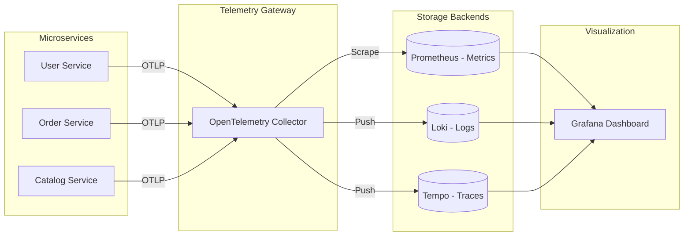

# 🚀 Master Setup: Spring Boot Microservices Observability (LGTM Stack)

This document provides a comprehensive, step-by-step guide to setting up a production-grade observability stack for Spring Boot microservices using **Loki, Grafana, Tempo, and Prometheus (LGTM)** with the **OpenTelemetry (OTel) Collector**.

---

## 🏗️ Architecture Overview

The following diagram illustrates how telemetry data flows from your microservices to the visualization layer.



---

## 📦 Step 1: Dependency Management

Add the core observability libraries to your **Parent POM** or **Common Library** to ensure consistency across all services.

### Core Dependencies (Spring Boot 3.x)
```xml
<dependencies>
    <!-- 1. Actuator: Exposes health and metrics -->
    <dependency>
        <groupId>org.springframework.boot</groupId>
        <artifactId>spring-boot-starter-actuator</artifactId>
    </dependency>

    <!-- 2. Micrometer Prometheus Registry: Converts Actuator metrics to PromQL format -->
    <dependency>
        <groupId>io.micrometer</groupId>
        <artifactId>micrometer-registry-prometheus</artifactId>
    </dependency>

    <!-- 3. Micrometer Tracing: Standardized tracing API -->
    <dependency>
        <groupId>io.micrometer</groupId>
        <artifactId>micrometer-tracing-bridge-otel</artifactId>
    </dependency>

    <!-- 4. OTLP Exporter: Sends traces to the OTel Collector -->
    <dependency>
        <groupId>io.opentelemetry</groupId>
        <artifactId>opentelemetry-exporter-otlp</artifactId>
    </dependency>

    <!-- 5. Loki4j: High-performance log appender for Loki -->
    <dependency>
        <groupId>com.github.loki4j</groupId>
        <artifactId>loki4j-logback-appender</artifactId>
        <version>1.4.1</version>
    </dependency>
</dependencies>
```

---

## ⚙️ Step 2: Centralized Configuration

Configure all microservices globally using **Spring Cloud Config** or a shared `application.yml`.

### `application.yml` (Shared)
```yaml
management:
  endpoints:
    web:
      exposure:
        include: health,metrics,prometheus # Expose monitoring endpoints
  tracing:
    sampling:
      probability: 1.0 # Capture 100% of traces (adjust for production)
  otlp:
    tracing:
      # Point to the OTel Collector (use localhost for host-based dev)
      endpoint: ${OTLP_ENDPOINT:http://localhost:4318/v1/traces}
  metrics:
    export:
      prometheus:
        enabled: true

# Custom property for Loki shipping
loki:
  url: ${LOKI_URL:http://localhost:3100/loki/api/v1/push}

logging:
  pattern:
    # Injects Trace ID and Span ID into every log line
    level: "[${spring.application.name},%X{traceId:-},%X{spanId:-}] %5p"
```

---

## 📝 Step 3: Standardized Logback (Trace Correlation)

Create a shared `logback-spring.xml` to handle both local console output and Loki log shipping.

```xml
<configuration>
    <include resource="org/springframework/boot/logging/logback/defaults.xml"/>
    <include resource="org/springframework/boot/logging/logback/console-appender.xml"/>

    <springProperty scope="context" name="appName" source="spring.application.name"/>
    <springProperty scope="context" name="lokiUrl" source="loki.url" defaultValue="http://localhost:3100/loki/api/v1/push"/>

    <appender name="LOKI" class="com.github.loki4j.logback.Loki4jAppender">
        <http><url>${lokiUrl}</url></http>
        <format>
            <label>
                <pattern>app=${appName},host=${HOSTNAME},level=%level</pattern>
            </label>
            <message>
                <pattern>[${appName},%X{traceId:-},%X{spanId:-}] %level %logger{36} - %msg</pattern>
            </message>
        </format>
    </appender>

    <root level="INFO">
        <appender-ref ref="CONSOLE"/>
        <appender-ref ref="LOKI"/>
    </root>
</configuration>
```

---

## 🐳 Step 4: Infrastructure (Docker Compose)

Spin up the LGTM stack. Note the `platform: linux/amd64` flag for Windows/Mac compatibility.

```yaml
services:
  otel-collector:
    image: otel/opentelemetry-collector-contrib
    platform: linux/amd64
    volumes:
      - ./otel-config.yml:/etc/otel-collector-config.yml
    ports:
      - "4318:4318" # OTLP HTTP

  prometheus:
    image: prom/prometheus:v2.45.0
    platform: linux/amd64
    ports: [9090:9090]

  loki:
    image: grafana/loki:latest
    platform: linux/amd64
    ports: [3100:3100]

  tempo:
    image: grafana/tempo:latest
    platform: linux/amd64
    ports: [3200:3200]

  grafana:
    image: grafana/grafana:latest
    platform: linux/amd64
    ports: [3000:3000]
```

---

## 🔍 Step 5: Verification Checklist

| Goal | Action | Expected Result |
| :--- | :--- | :--- |
| **Metrics** | Open `actuator/prometheus` | Valid Prometheus metrics list. |
| **Logs** | Query `{app="user-service"}` in Loki | Logs appear with Trace IDs. |
| **Traces** | Click Trace ID in Loki logs | Screen splits to show Tempo Trace Graph. |
| **Health** | Check Grafana Data Sources | Prometheus, Loki, Tempo show "Green". |

> [!TIP]
> **Correlation is Key**: Always ensure your Log Pattern matches your Tracing Bridge. If the Trace IDs aren't appearing in logs, Loki won't be able to link to Tempo!
