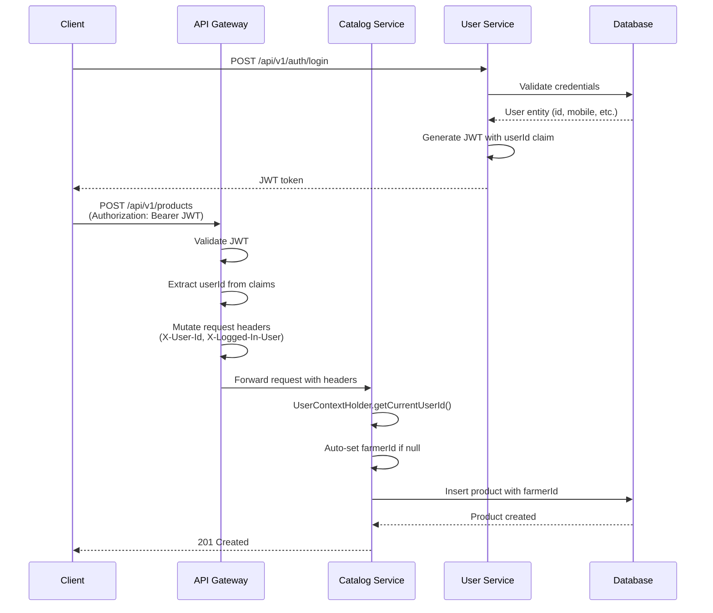

# User Context Extraction Implementation - Walkthrough

## Overview
Successfully implemented user context extraction across the microservices architecture, enabling automatic identification of logged-in users and seamless propagation of user information from the API Gateway to downstream services.

## Changes Made

### Phase 1: API Gateway Fixes

#### Fixed Critical Header Mutation Bug
**File:** [`AuthenticationFilter.java`](file:///d:/Rural_marketplace_App/RuralMarketPlace-backend/api-gateway/src/main/java/com/rural/marketplace/gateway/filter/AuthenticationFilter.java)

**Problem:** The mutated exchange with user headers was created but never used in the filter chain.

**Solution:**
```java
// Before (Bug):
exchange.mutate().request(...).build();  // Created but not used
return chain.filter(exchange);  // Original exchange passed

// After (Fixed):
ServerWebExchange mutatedExchange = exchange.mutate()
    .request(exchange.getRequest().mutate()
        .header("X-Logged-In-User", username)
        .header("X-User-Id", userId.toString())
        .build())
    .build();
return chain.filter(mutatedExchange);  // Mutated exchange passed
```

**Impact:** Downstream services now receive user context headers correctly.

---

### Phase 2: JWT Token Enhancement

#### Added User ID to JWT Claims
**File:** [`AuthController.java`](file:///d:/Rural_marketplace_App/RuralMarketPlace-backend/user-service/src/main/java/com/rural/marketplace/user/controller/AuthController.java)

**Enhancement:**
```java
// Step 4: Generate JWT token with userId claim
Map<String, Object> extraClaims = new HashMap<>();
extraClaims.put("userId", user.getId());
String jwtToken = jwtService.generateToken(extraClaims, userDetails);
```

**Benefit:** JWT tokens now contain both username and userId, eliminating the need for database lookups in the Gateway.

---

### Phase 3: UserContextHolder Utility

#### Created Reusable Utility Class
**File:** [`UserContextHolder.java`](file:///d:/Rural_marketplace_App/RuralMarketPlace-backend/common-library/src/main/java/com/rural/marketplace/common/context/UserContextHolder.java)

**Features:**
- `getCurrentUserId(request)` - Extract user ID from headers
- `getCurrentUsername(request)` - Extract username from headers  
- `hasUserContext(request)` - Check if user context exists

**Usage Example:**
```java
Long userId = UserContextHolder.getCurrentUserId(request);
String username = UserContextHolder.getCurrentUsername(request);
```

#### Added Servlet Dependency
**File:** [`common-library/pom.xml`](file:///d:/Rural_marketplace_App/RuralMarketPlace-backend/common-library/pom.xml)

Added `jakarta.servlet-api` with `provided` scope to support `HttpServletRequest`.

---

### Phase 4: ProductController Integration

#### Auto-Populate Farmer ID
**File:** [`ProductController.java`](file:///d:/Rural_marketplace_App/RuralMarketPlace-backend/catalog-service/src/main/java/com/rural/marketplace/catalog/controller/ProductController.java)

**Both Endpoints Enhanced:**

1. **JSON Endpoint** (`POST /api/products`):
```java
@PostMapping(consumes = MediaType.APPLICATION_JSON_VALUE)
public ResponseEntity<ProductDTO> createProduct(
        @Valid @RequestBody ProductDTO productDTO,
        HttpServletRequest request) {
    
    // Auto-populate farmerId from logged-in user if not explicitly set
    if (productDTO.getFarmerId() == null) {
        Long userId = UserContextHolder.getCurrentUserId(request);
        productDTO.setFarmerId(userId);
    }
    
    return new ResponseEntity<>(productService.createProduct(productDTO, null), HttpStatus.CREATED);
}
```

2. **Multipart Endpoint** (`POST /api/products/with-image`):
```java
// Same auto-population logic applied
```

**Behavior:**
- If `farmerId` is provided in request → Use provided value
- If `farmerId` is null → Auto-populate from logged-in user
- If no user context → farmerId remains null

---

## How It Works (End-to-End Flow)



---

## Testing Instructions

### 1. Restart Services
You need to restart the following services for changes to take effect:

```bash
# Restart in this order:
1. common-library (rebuild: mvn clean install)
2. api-gateway
3. user-service
4. catalog-service
```

### 2. Test Login with User ID in Token

**Request:**
```http
POST http://localhost:8080/api/v1/auth/login
Content-Type: application/json

{
  "mobileNumber": "9876543210",
  "password": "password123"
}
```

**Expected Response:**
```json
{
  "token": "eyJhbGciOiJIUzI1NiJ9...",
  "mobileNumber": "9876543210",
  "fullName": "John Doe",
  "role": "FARMER"
}
```

**Verify Token Contains userId:**
Decode the JWT at [jwt.io](https://jwt.io) and verify the payload contains:
```json
{
  "userId": 1,
  "sub": "9876543210",
  "iat": 1706270400,
  "exp": 1706356800
}
```

### 3. Test Product Creation Without farmerId

**Request:**
```http
POST http://localhost:8080/api/v1/products
Authorization: Bearer <JWT_TOKEN>
Content-Type: application/json

{
  "name": "Radish",
  "description": "Quality Radish from farm",
  "price": 20,
  "stockQuantity": 50,
  "categoryId": 7
}
```

**Expected Behavior:**
- ✅ Product created successfully
- ✅ `farmerId` auto-populated with logged-in user's ID
- ✅ Response includes `farmerId`

**Expected Response:**
```json
{
  "id": 6,
  "name": "Radish",
  "description": "Quality Radish from farm",
  "price": 20.00,
  "stockQuantity": 50,
  "categoryId": 7,
  "farmerId": 1,  // Auto-populated!
  "imageUrl": null,
  "location": null
}
```

### 4. Test Product Creation With Explicit farmerId

**Request:**
```http
POST http://localhost:8080/api/v1/products
Authorization: Bearer <JWT_TOKEN>
Content-Type: application/json

{
  "name": "Tomato",
  "description": "Fresh tomatoes",
  "price": 30,
  "stockQuantity": 100,
  "categoryId": 7,
  "farmerId": 5  // Explicitly set
}
```

**Expected Behavior:**
- ✅ Product created with `farmerId: 5` (explicit value respected)

---

## Benefits Achieved

### 1. **Zero Database Lookups**
- Gateway extracts userId from JWT claims (already validated)
- No need to query user-service for user ID

### 2. **Automatic Context Propagation**
- User context flows seamlessly from Gateway to all services
- Headers: `X-User-Id`, `X-Logged-In-User`

### 3. **Reusable Utility**
- `UserContextHolder` can be used in any microservice
- Consistent API across the platform

### 4. **Flexible Behavior**
- Auto-populate when not provided
- Respect explicit values when provided
- Works for both JSON and multipart endpoints

### 5. **Security**
- User context comes from validated JWT
- Cannot be spoofed (Gateway validates before adding headers)
- Downstream services trust Gateway's headers

---

## Files Modified

| File | Changes |
|------|---------|
| [`api-gateway/.../AuthenticationFilter.java`](file:///d:/Rural_marketplace_App/RuralMarketPlace-backend/api-gateway/src/main/java/com/rural/marketplace/gateway/filter/AuthenticationFilter.java) | Fixed header mutation bug, added userId extraction |
| [`user-service/.../AuthController.java`](file:///d:/Rural_marketplace_App/RuralMarketPlace-backend/user-service/src/main/java/com/rural/marketplace/user/controller/AuthController.java) | Added userId claim to JWT generation |
| [`common-library/.../UserContextHolder.java`](file:///d:/Rural_marketplace_App/RuralMarketPlace-backend/common-library/src/main/java/com/rural/marketplace/common/context/UserContextHolder.java) | **NEW** - Utility for extracting user context |
| [`common-library/pom.xml`](file:///d:/Rural_marketplace_App/RuralMarketPlace-backend/common-library/pom.xml) | Added servlet-api dependency |
| [`catalog-service/.../ProductController.java`](file:///d:/Rural_marketplace_App/RuralMarketPlace-backend/catalog-service/src/main/java/com/rural/marketplace/catalog/controller/ProductController.java) | Integrated UserContextHolder, auto-populate farmerId |
